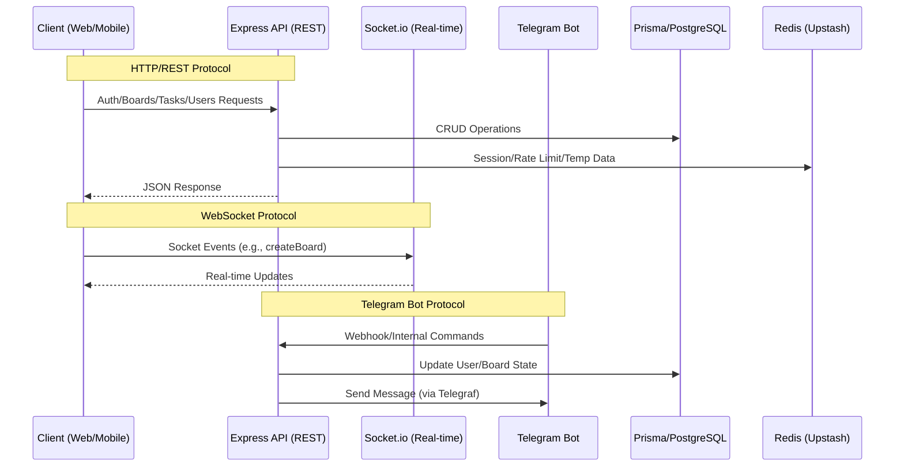

---
# Public Interface & Contracts

## Interface Map

## Endpoints / Exports

The system exposes three primary interface boundaries: RESTful HTTP endpoints, WebSocket event handlers, and a Telegram Bot interface.

### 1. REST API (Express)
All routes are prefixed via `API_PREFIX` (default `/api/v1`) defined in [[.env.example]].

#### Authentication & Identity
*   `POST /auth/login` — User authentication via email/password. [[routes/auth/login/loginRoute.js]]
*   `POST /auth/guest-login` — Provisioning of guest sessions. [[routes/auth/login/guestRoute.js]]
*   `POST /auth/refresh` — JWT rotation and session extension. [[routes/auth/refresh/refreshRoute.js]]
*   `POST /auth/logout` — Single device logout. [[routes/auth/logout/logoutUserRoute.js]]
*   `POST /auth/logout/all` — Global session revocation. [[routes/auth/logout/logoutAllUserDevices.js]]
*   `POST /auth/totp/verify` — 2FA verification. [[routes/auth/totp/verification/verificationTotp.js]]
*   `POST /auth/oauth/{provider}` — OAuth2 flows (Google, GitHub, Yandex). [[routes/auth/google/connect/googleAuthRoute.js]], [[routes/auth/github/connect/githubAuthRoute.js]], [[routes/auth/yandex/connect/yandexAuthRoute.js]]

#### Board Management
*   `GET /boards` — Fetch user boards with task counts. [[routes/boards/getBoardsRoute.js]]
*   `POST /boards` — Create new board. [[routes/boards/createBoardRoute.js]]
*   `PATCH /boards/:boardUuid` — Update board metadata. [[routes/boards/updateBoardRoute.js]]
*   `DELETE /boards/:boardUuid` — Soft-delete board and associated tasks. [[routes/boards/deleteBoardRoute.js]]

#### Task Management
*   `GET /boards/:boardUuid/tasks` — Fetch tasks for a specific board. [[routes/tasks/getTasksRoute.js]]
*   `POST /boards/:boardUuid/tasks` — Create task within a board. [[routes/tasks/createTaskRoute.js]]
*   `PATCH /boards/:boardUuid/tasks/:taskUuid` — Update task properties. [[routes/tasks/updateTaskRoute.js]]
*   `DELETE /boards/:boardUuid/tasks/:taskUuid` — Soft-delete a task. [[routes/tasks/deleteTaskRoute.js]]

#### User Profile & Settings
*   `GET /users` — Fetch current user profile. [[routes/users/get/getUserRoute.js]]
*   `PATCH /users` — Update profile (email/login) with confirmation. [[routes/users/update/updateUserRoute.js]]
*   `PATCH /users/avatar` — Update user avatar via Cloudinary. [[routes/users/update/updateUserAvatar.js]]
*   `GET /users/devices` — List active device sessions. [[routes/users/get/getUserDevices.js]]

### 2. WebSocket Interface (Socket.io)
*   `disconnect` — Emitted when a client loses connection. [[socket/handlers.js]]
*   `createBoard` — Client-side trigger for board creation. [[socket/handlers.js]]

### 3. Telegram Bot Interface
*   `Command: /start` — Initialization and auth link. [[telegramBot/commands/auth/startCommand.js]]
*   `Command: /menu` — Main navigation. [[telegramBot/commands/menu/menuCommand.js]]
*   `Command: /help` — Help documentation. [[telegramBot/commands/help/helpCommand.js]]
*   `Command: /me` — Profile view. [[telegramBot/commands/users/meCommand.js]]
*   `Callback: show_profile` — Interactive button handler. [[telegramBot/handlers/callbackHandler.js]]

## Data Models

### User Entity
The core identity object.
*   `uuid`: Primary identifier (UUID v4).
*   `email`: Normalized email address.
*   `role`: `user` | `guest` | `admin`.
*   `twoFactorEnabled`: Boolean flag for TOTP requirement.
*   `isDeleted`: Soft-delete flag.
*   *Source:* [[prisma/schema.prisma]]

### Board Entity
*   `uuid`: Primary identifier.
*   `title`: Sanitized string (max 64 chars).
*   `color`: Hex color code.
*   `isPinned`: Boolean.
*   `isFavorite`: Boolean.
*   *Source:* [[routes/boards/createBoardRoute.js]]

### Task Entity
*   `uuid`: Primary identifier.
*   `title`: Sanitized string (max 64 chars).
*   `description`: Sanitized text.
*   `priority`: `LOW` | `MEDIUM` | `HIGH` (Enum).
*   `status`: `TODO` | `IN_PROGRESS` | `DONE` (Enum).
*   `dueDate`: ISO Date/Time.
*   *Source:* [[routes/tasks/createTaskRoute.js]]

## Contract Risks

> [!WARNING]
> **Unresolved Import Dependency**
> In [[telegramBot/actions/chooseColorAction.js]], there is an unresolved import specifier `#store/tempBoardCreationStore.js`. This indicates a broken link in the Telegram bot workflow that will cause runtime failure during color selection.

> [!CAUTION]
> **OAuth Redirect Variability**
> OAuth callback URIs are environment-dependent (localhost vs production). Integration tests must account for the `redirect_uri` mismatch if the `BASE_URL` in [[.env.example]] is not correctly aligned with the provider's registered callback.

> [!NOTE]
> **Rate Limiting Strictness**
> The API implements aggressive rate limiting via `express-rate-limit` (e.g., 5 attempts for TOTP, 20 for OAuth). Clients must implement exponential backoff to avoid permanent IP blocking in production.

# OpenAPI Specification