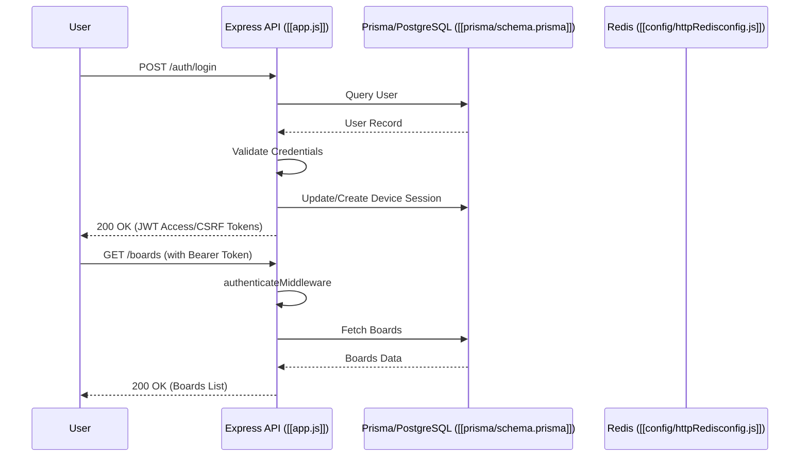

# Public Interface & Contracts

## Interface Map



## Endpoints / Exports

The API is structured as an Express application with route modularization via [[utils/routesLoader/loadRoutes.js]].

### Authentication
| Method | Endpoint | Description | Status Codes | Source |
| :--- | :--- | :--- | :--- | :--- |
| POST | `/auth/login` | Login with credentials | 200, 401, 429 | [[routes/auth/login/loginRoute.js]] |
| POST | `/auth/guest-login` | Anonymous guest access | 200, 401 | [[routes/auth/login/guestRoute.js]] |
| POST | `/auth/logout` | Revoke session | 200, 204 | [[routes/auth/logout/logoutUserRoute.js]] |
| POST | `/auth/refresh` | Refresh access token | 200, 401 | [[routes/auth/refresh/refreshRoute.js]] |

### Boards
| Method | Endpoint | Description | Status Codes | Source |
| :--- | :--- | :--- | :--- | :--- |
| GET | `/boards` | List user boards | 200 | [[routes/boards/getBoardsRoute.js]] |
| POST | `/boards` | Create board | 201, 400 | [[routes/boards/createBoardRoute.js]] |
| PATCH | `/boards/:boardUuid` | Update board | 200, 400, 404 | [[routes/boards/updateBoardRoute.js]] |
| DELETE | `/boards/:boardUuid` | Delete board | 200, 404 | [[routes/boards/deleteBoardRoute.js]] |

### Tasks
| Method | Endpoint | Description | Status Codes | Source |
| :--- | :--- | :--- | :--- | :--- |
| GET | `/boards/:boardUuid/tasks` | List tasks | 200 | [[routes/tasks/getTasksRoute.js]] |
| POST | `/boards/:boardUuid/tasks` | Create task | 201, 400 | [[routes/tasks/createTaskRoute.js]] |
| PATCH | `/boards/:boardUuid/tasks/:taskUuid` | Update task | 200, 400 | [[routes/tasks/updateTaskRoute.js]] |
| DELETE | `/boards/:boardUuid/tasks/:taskUuid` | Delete task | 200, 404 | [[routes/tasks/deleteTaskRoute.js]] |

> [!IMPORTANT]
> All authenticated routes require the `Authorization: Bearer <JWT>` header and `X-CSRF-Token` header, validated by [[middlewares/http/authenticateMiddleware.js]].

## Data Models

### User DTO
```json
{
  "uuid": "550e8400-e29b-41d4-a716-446655440000",
  "login": "johndoe",
  "email": "user@example.com",
  "role": "user",
  "twoFactorEnabled": false,
  "avatarUrl": "https://res.cloudinary.com/..."
}
```

### Board DTO
```json
{
  "uuid": "7c9e6679-7425-40de-944b-e07fc1f90ae7",
  "title": "Project Alpha",
  "color": "ff0000",
  "isPinned": false,
  "isFavorite": false
}
```

## Contract Risks

> [!WARNING]
> **Implicit Dependencies:** Several modules (e.g., [[telegramBot/actions/chooseColorAction.js]]) reference internal stores using non-standard import specifiers (e.g., `#store/tempBoardCreationStore.js`), which may break if the resolution configuration in `package.json` is modified.

> [!CAUTION]
> **Orphaned Modules:** The codebase contains many modules (e.g., [[routes/auth/reset/resetPasswordRoute.js]]) that are currently empty or unimplemented, representing incomplete contract surfaces that may lead to runtime 404s if integrated prematurely.

# OpenAPI Specification

OpenAPI documentation is not provided as the project is a dynamic Express/Prisma application; static definitions would require synchronization with the `routes/` directory structure. For architectural compliance, refer to the `Endpoints / Exports` table above.