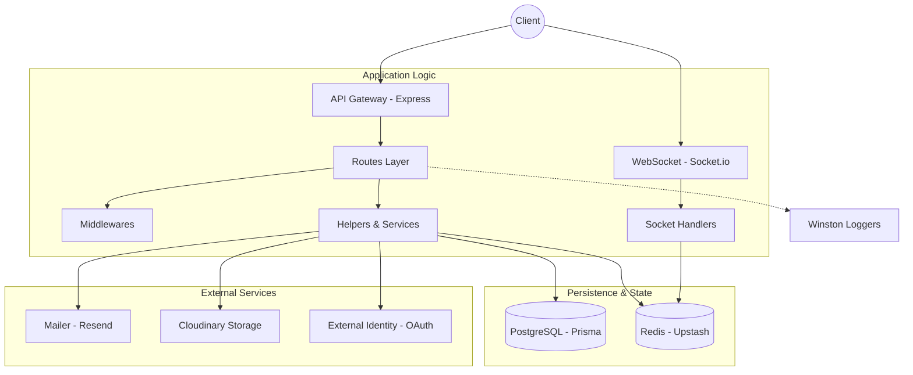
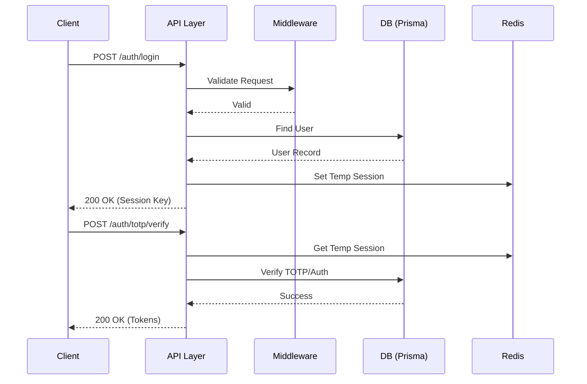

# Deep Engineering Architecture

## 🚀 Global Data Flow

The system operates as a distributed event-driven and request-response architecture. Incoming traffic is handled by an Express-based API layer, while real-time communication is facilitated via Socket.io. Data persistence is managed by Prisma with PostgreSQL, and transient state (sessions, temp data) is cached in Redis.

> [!NOTE]
> Canonical file references: [[app.js]], [[server.js]], [[socket/index.js]], [[utils/prismaConfig/prismaClient.js]], [[config/httpRedisconfig.js]].

## 🛠️ Core Interface Flows

This sequence diagram illustrates the typical authentication and authorization flow through the system.

> [!TIP]
> Traceability legend:
> - [[routes/auth/login/loginRoute.js]] handles the login request.
> - [[middlewares/http/authenticateMiddleware.js]] enforces the session security.
> - [[utils/tokens/accessToken.js]] and [[utils/tokens/refreshToken.js]] manage the session lifecycle.

## ⚙️ Architectural Decision Records (ADRs)

### 📄 ADR-001: Centralized Logging via Winston and Loki
*   **Context**: The system requires distributed tracing and centralized log management across multiple entry points (API, Telegram Bot, Socket).
*   **Decision**: Implement a unified logging interface using [[utils/loggers/baseLogger.js]].
*   **Rationale**: Standardized log formats (JSON) simplify ingestion into Loki. Centralization prevents fragmented operational visibility.
*   **Consequences**: Increased dependency on `winston-loki` and strict adherence to the logging schema defined in [[utils/loggers/baseLogger.js]].

### 📄 ADR-002: Redis-based Transient State Management
*   **Context**: Authentication, OTP verification, and temporary user data need to be shared across horizontally scaled instances.
*   **Decision**: Utilize Upstash Redis for all transient session and temporary data store.
*   **Rationale**: Low latency and native support for key expiration (TTL) reduces complexity for managing short-lived data like registration codes and OAuth states.
*   **Consequences**: Hard dependency on Redis configuration in [[config/httpRedisconfig.js]].

## 📦 Module Deep-Dives

### Module: [[utils/helpers/userHelpers.js]]
- **Responsibility**: Provides core domain logic for user retrieval, validation of existence, and verification of OAuth capabilities.
- **Internal Logic**: Wraps [[utils/prismaConfig/prismaClient.js]] to perform domain-specific queries (e.g., finding active users only).
- **Upstream Callers**: [[routes/auth/github/connect/githubConnectRoute.js]], [[routes/auth/login/loginRoute.js]], [[routes/users/get/getUserRoute.js]].
- **Downstream Dependencies**: [[utils/prismaConfig/prismaClient.js]], [[utils/validators/taskValidators.js]].

### Module: [[utils/loggers/authLoggers.js]]
- **Responsibility**: Specialized logging for security-sensitive auth actions.
- **Internal Logic**: Filters sensitive fields (like passwords) and formats authentication events for the centralized log stream.
- **Upstream Callers**: Almost all routes under [[routes/auth/]].
- **Downstream Dependencies**: [[utils/loggers/baseLogger.js]].

## 🛡️ Structural & Integration Risks

> [!WARNING]
> **Contract Risk**: The dependency graph shows significant unresolved imports (e.g., `#store/tempBoardCreationStore.js` in [[telegramBot/actions/chooseColorAction.js]]). This indicates an unstable module boundary.

> [!CAUTION]
> **Hotspot Risk**: [[utils/helpers/authHelpers.js]] and [[utils/loggers/authLoggers.js]] are critical hotspots with high inbound dependency counts. Any change to these files requires broad regression testing across the entire authentication domain.

> [!NOTE]
> **Orphan Modules**: Multiple files in `.adminjs/` and `jsdoc-configs/` appear disconnected from the primary runtime flow. These should be audited for dead code or architectural drift.